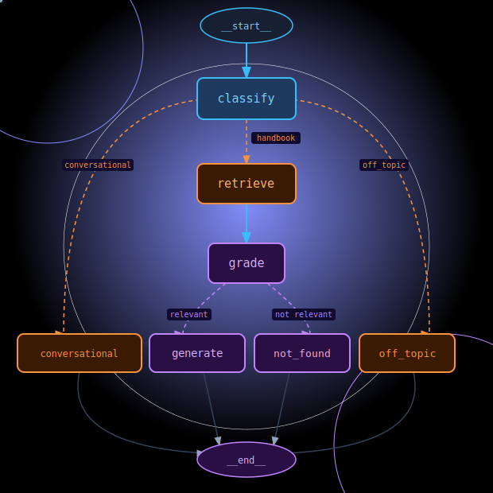

# handbook-agent

A RAG agent built with LangGraph to answer questions about the Agile Lab company handbook.

---

## Architecture



The agent classifies each question before routing it :

- **handbook** → full RAG pipeline (retrieve → grade → generate)
- **conversational** → direct LLM response, no retrieval
- **off_topic** → politely declined
- **not_found** → question is in scope but not covered by the handbook

**Stack**

| Component     | Technology                    |
|---------------|-------------------------------|
| Orchestration | LangGraph                     |
| LLM           | OpenAI GPT-4o / GPT-4o-mini   |
| Vector store  | Chroma                        |
| Embeddings    | OpenAI text-embedding-3-small |
| Evaluation    | MLflow 3                      |
| UI            | HTML / JS                     |
| API           | FastAPI                       |

---

## Project Structure

```
handbook-agent/
├── src/
│   ├── agent/
│   │   └── agent.py
│   ├── api/
│   │   └── app.py
│   ├── ui/
│   │   ├── app.js
│   │   ├── index.html
│   │   └── style.css
│   └── main.py
├── evaluation/
│   ├── data/
│   │   ├── graph/
│   │   │   ├── inputs/
│   │   │   │   └── nodes.yaml
│   │   │   └── outputs/
│   │   │       ├── eval_classify.csv
│   │   │       ├── eval_grade.csv
│   │   │       ├── eval_retrieve.csv
│   │   │       └── eval_routing.csv
│   │   └── lash/
│   │       └── inputs/
│   │           └── lash_suites.yaml
│   ├── graph/
│   │   ├── graph_eval.py
│   │   ├── graph_structure_eval.py
│   │   └── nodes.py
│   ├── lash/
│   │   ├── lash_evaluate.py
│   │   ├── lash_metrics.py
│   │   └── lash_suites.py
│   ├── graph_structure.yaml
│   └── main.py
├── crawl/
│   └── crawler.py
├── embed/
│   └── embeder.py
├── grader/
│   └── grade.py
├── data/
│   └── corpus.json
├── static/
│   ├── agilelab_logo.jpeg
│   ├── app.js
│   └── style.css
├── chroma_db/              # not committed
├── mlruns/                 # not committed
├── mlflow.db               # not committed
├── graph.png
├── graph.svg
├── pyproject.toml
├── uv.lock
└── .env                    # not committed
```

---

## Getting Started

### Prerequisites

- Python 3.11+
- [uv](https://docs.astral.sh/uv/)
- OpenAI API key

### Installation

```bash
git clone https://github.com/<your-username>/handbook-agent.git
cd handbook-agent
uv sync
```

### Configuration

```bash
cp .env.example .env
```

```env
OPENAI_API_KEY=sk-...
CHROMA_PERSIST_DIR=./chroma_db
COLLECTION_NAME=agilelab_handbook
```

### Pipeline

```bash
# 1. Crawl the handbook
uv run python crawl/crawler.py

# 2. Ingest into Chroma
uv run python embed/embeder.py

# 3. Run locally
uv run python src/main.py

# 4. Or start the API
uv run uvicorn src.api.app:app --reload
```

---

## Evaluation

The agent is evaluated using **LASH** — a custom evaluation protocol designed for this project to assess four dimensions of response quality :

| Letter | Dimension   | Weight | Scorer                        |
|--------|-------------|--------|-------------------------------|
| L      | Latency     | 10%    | Custom `@scorer` (code-based) |
| A      | Accuracy    | 40%    | `Correctness()` (MLflow)      |
| S      | Safety      | 20%    | `Safety()` (MLflow)           |
| H      | Helpfulness | 30%    | `Guidelines(...)` (MLflow)    |

LASH uses a **2-step validation** :

1. **Each dimension must individually pass its threshold** — L ≥ 0.60, A ≥ 0.70, S ≥ 0.60, H ≥ 0.70
2. **The weighted overall score must pass** — LASH ≥ 0.65

Both conditions must be true. If any single dimension fails, the evaluation is marked as **FAIL** regardless of the overall score. A high weighted average cannot mask a critical failure on one dimension.

In addition to end-to-end evaluation, each internal graph node is evaluated independently (classify accuracy, retrieve relevance, grade correctness, routing paths, graph structure).

```bash
# LASH evaluation
uv run python -m evaluation.lash_evaluate

# Graph node evaluation
uv run python -m evaluation.graph_eval

# MLflow UI
uv run mlflow ui  # → http://localhost:5000
```

---

## License

MIT